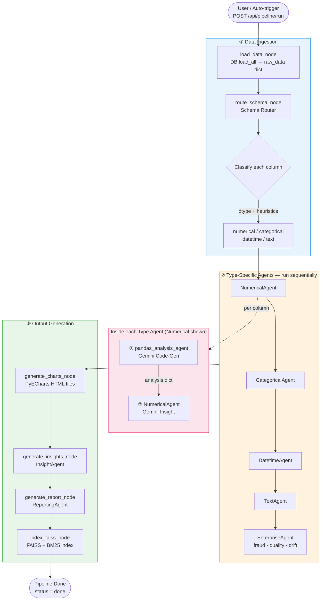
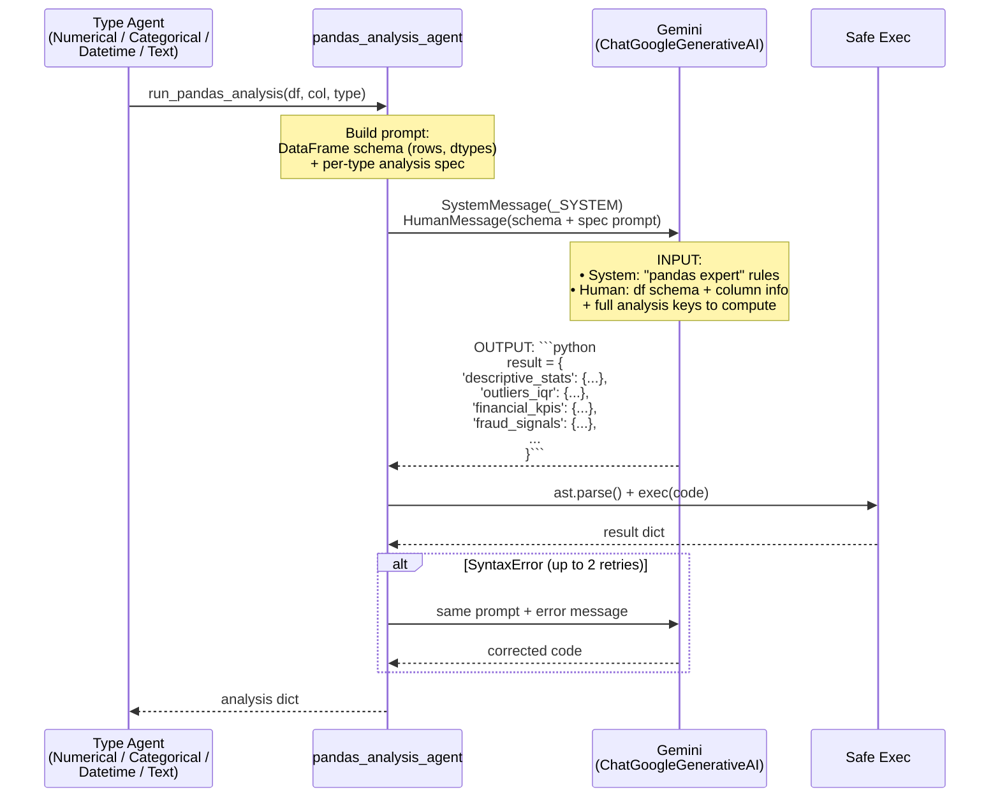
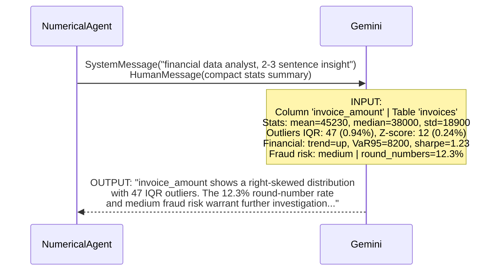
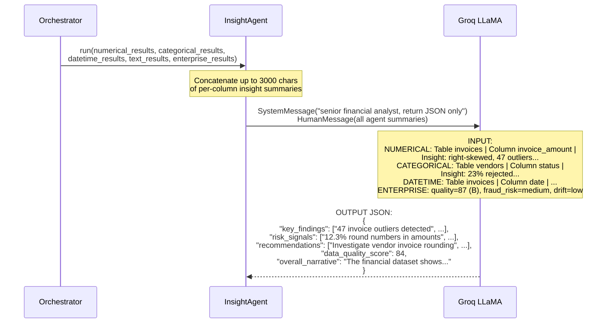
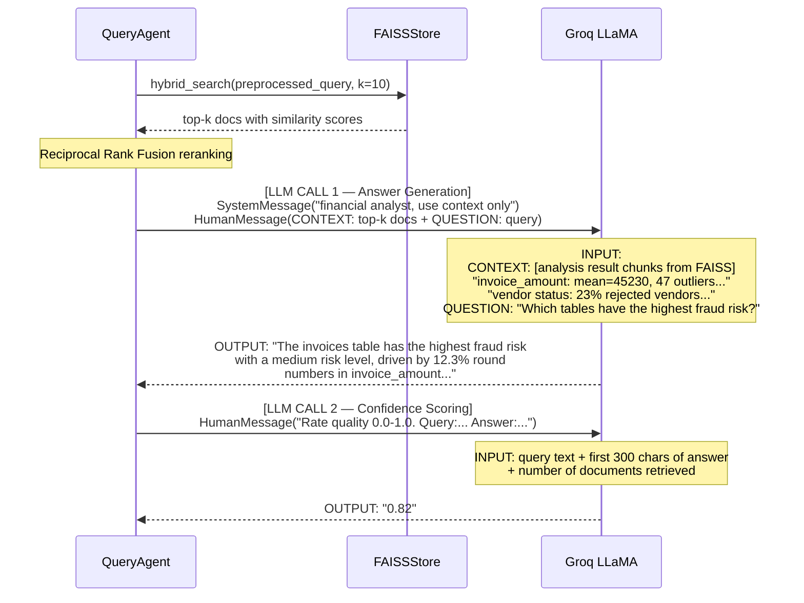
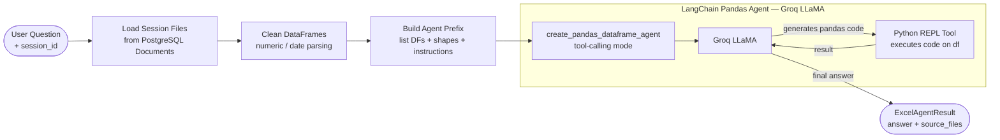
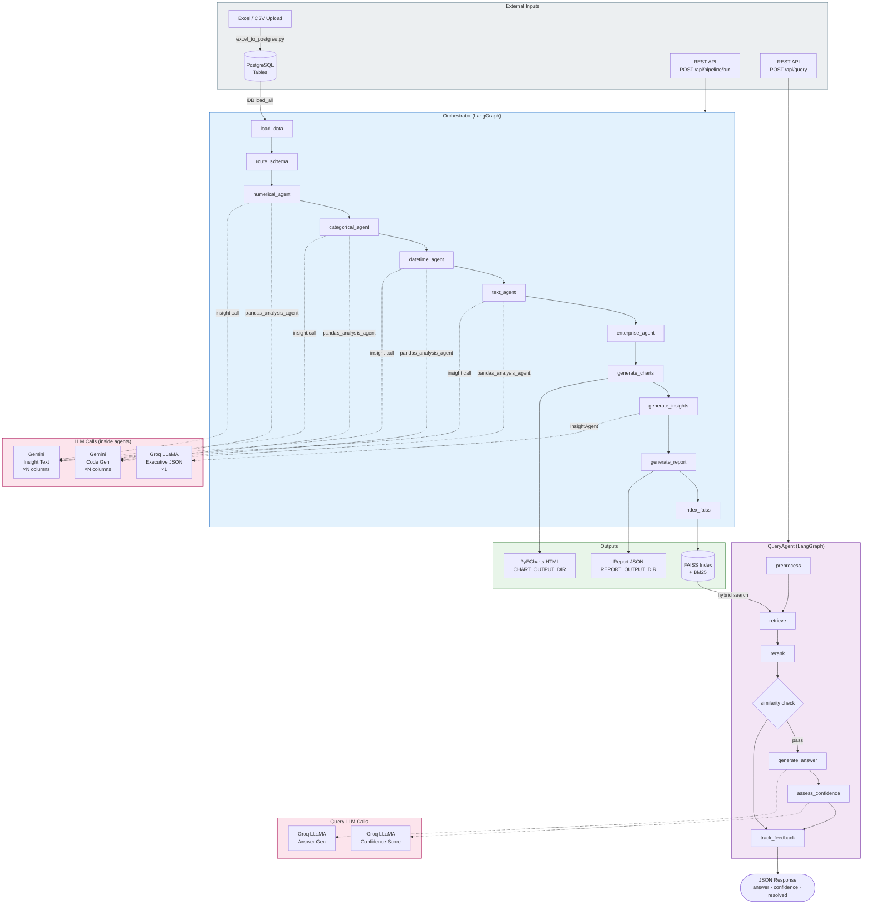
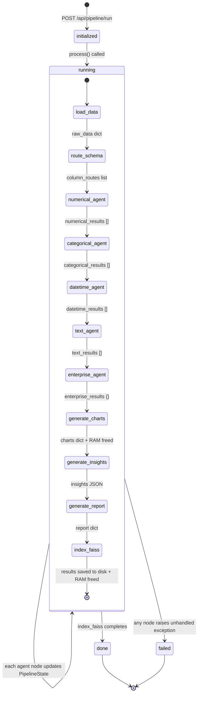

# 4sight v3 — System Architecture & LLM Flow

## Overview

4sight v3 is a multi-agent financial data analysis system built on LangGraph. It has **two independent flows**:
1. **Analysis Pipeline** — reads PostgreSQL tables, runs type-specific agents, generates charts + insights
2. **Query Flow (RAG)** — answers natural-language questions against the indexed analysis results

Two LLMs are used throughout:
- **Gemini** (`ChatGoogleGenerativeAI`) — code generation + per-column insights (high quality, structured output)
- **Groq LLaMA** (`ChatGroq`) — executive insights, RAG answers, confidence scoring (fast, cost-efficient)

---

## 1. Main Analysis Pipeline



---

## 2. LLM Call — Gemini Code Generation (pandas_analysis_agent)

Called once per column, per agent type.



**Input to Gemini:**
```
DATAFRAME SCHEMA — 5000 rows
Columns: invoice_amount (float64), vendor_id (object), date (datetime64)
TARGET COLUMN: `invoice_amount`  |  dtype: float64  |  non-null: 4987/5000
------------------------------------------------------------
Analyze column `invoice_amount` in DataFrame `df`. Build `result` with:
  descriptive_stats — dict: mean, median, std, min, max, skewness ...
  outliers_iqr — dict: count, pct  ...
  financial_kpis — dict: total_sum, trend_direction, var_95, sharpe_ratio ...
  fraud_signals — dict: round_number_pct, negative_value_count, fraud_risk_level ...
```

**Output from Gemini:**
```python
result = {
    'descriptive_stats': {'mean': 45230.5, 'median': 38000.0, ...},
    'outliers_iqr': {'count': 47, 'pct': 0.94},
    'financial_kpis': {'total_sum': 225678900.0, 'trend_direction': 'up', ...},
    'fraud_signals': {'round_number_pct': 12.3, 'fraud_risk_level': 'medium'},
}
```

---

## 3. LLM Call — Gemini Insight Text (per column)

After the analysis dict is computed, the same agent makes a second Gemini call to generate human-readable insight.



> Same pattern applies to **CategoricalAgent**, **DatetimeAgent**, and **TextAgent** — each uses Gemini for both code generation and insight text.

---

## 4. LLM Call — Groq Executive Insight (InsightAgent)

Runs once after all type-specific agents complete.



---

## 5. RAG Query Flow (QueryAgent)

Separate LangGraph pipeline, available after pipeline completes.

```mermaid
flowchart TD
    U([User\nPOST /api/query\n{"query": "..."}]) --> QP

    subgraph QG["LangGraph — QueryAgent"]
        QP[preprocess_query\nQueryPreprocessor\nexpand + normalize] --> RD
        RD[retrieve_docs\nFAISS + BM25\nhybrid search] --> RR
        RR[rerank_docs\nReciprocal Rank Fusion] --> CS

        CS{check_similarity\ntop score ≥ threshold?}
        CS -->|NO — out of scope| TF
        CS -->|YES — data related| GA

        GA[generate_answer\nGroq LLaMA] --> AC
        AC[assess_confidence\nGroq LLaMA] --> TF
        TF[track_feedback\nlog to FeedbackTracker]
    end

    TF --> R([Response\n{answer, confidence, resolved}])

    style QG fill:#f3e5f5,stroke:#9C27B0
```

### Query LLM Calls



---

## 6. Excel Tool Agent Flow

Used for direct questions against uploaded Excel/CSV files.



---

## 7. Complete System Map



---

## 8. LLM Summary Table

| Call Site | Model | Input | Output | When |
|-----------|-------|-------|--------|------|
| `pandas_analysis_agent` | **Gemini** | DataFrame schema + per-type analysis spec | Python/pandas code block | Once per column (×N) |
| `NumericalAgent._run_column` | **Gemini** | Compact stats summary (text) | 2-3 sentence insight | Once per numerical column |
| `CategoricalAgent._run_column` | **Gemini** | Category freq summary | 2-3 sentence insight | Once per categorical column |
| `DatetimeAgent._run_column` | **Gemini** | Date range / trend summary | 2-3 sentence insight | Once per datetime column |
| `TextAgent._run_column` | **Gemini** | Sentiment / top-words summary | 2-3 sentence insight | Once per text column |
| `InsightAgent.run` | **Groq LLaMA** | All agent summaries concatenated | JSON executive summary | Once per pipeline run |
| `QueryAgent._generate_answer_node` | **Groq LLaMA** | FAISS context + user question | Answer text | Once per query |
| `QueryAgent._assess_confidence_node` | **Groq LLaMA** | Query + answer + doc count | Confidence float (0–1) | Once per query |
| `ExcelToolAgent._invoke_agent_sync` | **Groq LLaMA** | DataFrame(s) + user question | Answer (multi-turn tool-calling) | Once per Excel query |

---

## 9. State Flow Through Pipeline


