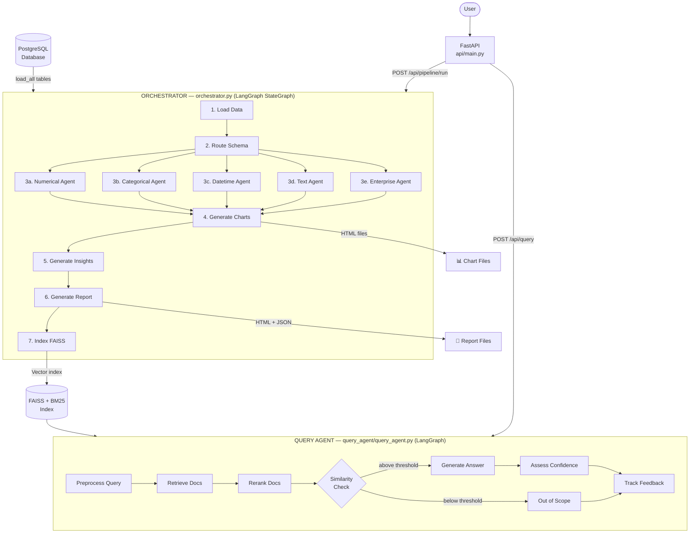
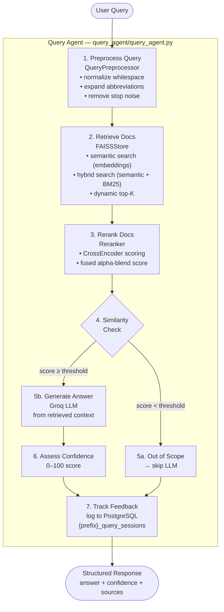

# 4sight v3 — Complete System Workflow

Multi-agent financial data analysis system. PostgreSQL → LangGraph orchestrator → 5 specialist agents → charts + insights + FAISS-powered query.

---

## 1. High-Level System Flow



---

## 2. Pipeline State — Data Carried Through All Nodes

Defined in [core/state.py](core/state.py) as a `TypedDict`.

| Field | Type | Set By |
|---|---|---|
| `run_id` | str | API on start |
| `table_prefix` | str | API on start |
| `raw_data` | `dict[str, DataFrame]` | Node 1 |
| `column_routes` | `list[ColumnRoute]` | Node 2 |
| `schema_info` | `dict[table][column] → type` | Node 2 |
| `numerical_results` | list | Node 3a |
| `categorical_results` | list | Node 3b |
| `datetime_results` | list | Node 3c |
| `text_results` | list | Node 3d |
| `enterprise_results` | list | Node 3e |
| `charts` | list | Node 4 |
| `insights` | dict | Node 5 |
| `report` | dict | Node 6 |
| `status` | str | Each node |
| `tables_analyzed` | list | Node 1 |
| `started_at` / `completed_at` | datetime | Orchestrator |

---

## 3. Node-by-Node Detail

### Node 1 — Load Data (`_load_data_node`)

```
PostgreSQL
    │
    ▼
DB.load_all(prefix)          ← db.py
    │  reads all matching tables as DataFrames
    ▼
state.raw_data = { table_name: DataFrame, ... }
state.tables_analyzed = [table_name, ...]
```

File: [orchestrator.py](orchestrator.py) · [db.py](db.py)

---

### Node 2 — Route Schema (`_route_schema_node`)

```
state.raw_data
    │
    ▼
schema_router.classify_all()          ← core/schema_router.py
    │
    ├─ 1. Collect column metadata
    │       dtype, sample values, null%, cardinality
    │
    ├─ 2. Batch-send to TypeDetectionAgent (Gemini LLM)
    │       chunk size: 60 columns per request
    │       output: { column: "numerical|categorical|datetime|text" }
    │
    └─ 3. Rule-Based Fallback (for any missing/invalid LLM output)
            bool dtype           → categorical
            numeric dtype        → numerical
            datetime64 dtype     → datetime
            object dtype:
              avg_len > 40 & unique_ratio > 0.5  → text
              unique_count ≤ cardinality limit    → categorical
              else                                → text
    │
    ▼
state.column_routes = [ColumnRoute(table, column, detected_type, ...)]
state.schema_info   = { table: { column: type } }
```

File: [core/schema_router.py](core/schema_router.py) · [agents/type_detection_agent.py](agents/type_detection_agent.py)

---

### Node 3a — Numerical Agent (`_run_numerical_agent_node`)

```
Numerical columns (from column_routes)
    │
    ▼  NumericalAgent.run()          ← agents/numerical_agent.py
    │
    ├─ calculate_descriptive_stats    mean, median, std, percentiles
    ├─ detect_outliers                IQR & Z-score methods
    ├─ analyze_distribution           histogram shape (normal/skewed/bimodal)
    ├─ calculate_financial_kpis       VaR, CVaR, Sharpe ratio, trend
    ├─ detect_missing_values          null%, MCAR/MAR/MNAR classification
    ├─ validate_datatypes             currency symbols, numeric-as-string
    ├─ detect_duplicates              row-level deduplication
    ├─ detect_isolation_forest        unsupervised anomaly detection
    ├─ detect_fraud_signals           round numbers, negatives, extremes
    ├─ analyze_kde_bimodal            heavy tails, bimodal detection
    ├─ calculate_vif                  multicollinearity scoring
    ├─ scale_normalize                StandardScaler / RobustScaler / MinMaxScaler
    └─ engineer_features              log / sqrt / ratio transformations
    │
    ├─ LLM (Groq): single call for insight interpretation
    └─ ChartAgent: selects Histogram or Heatmap
    │
    ▼
state.numerical_results = [NumericalResult, ...]
```

File: [agents/numerical_agent.py](agents/numerical_agent.py) · [agents/chart_agent.py](agents/chart_agent.py)

---

### Node 3b — Categorical Agent (`_run_categorical_agent_node`)

```
Categorical columns
    │
    ▼  CategoricalAgent.run()        ← agents/categorical_agent.py
    │
    ├─ analyze_frequency             value counts, dominant %, rare categories
    ├─ analyze_cardinality           unique count, low/high classification
    ├─ analyze_imbalance             dominant/minority class ratio
    ├─ detect_missing_categories     null%, mode, unknown values
    ├─ validate_categories           case inconsistencies, typos, whitespace
    ├─ encode_categories             label / frequency / one-hot encoding
    ├─ analyze_relationships         Chi-squared + Cramér's V
    └─ analyze_segmentation          numeric aggregation grouped by category
    │
    ├─ LLM (Gemini): single call for insight interpretation
    └─ ChartAgent: selects Pie / Bar / Countplot / Stacked Bar
    │
    ▼
state.categorical_results = [CategoricalResult, ...]
```

File: [agents/categorical_agent.py](agents/categorical_agent.py)

---

### Node 3c — Datetime Agent (`_run_datetime_agent_node`)

```
Datetime columns
    │
    ▼  DatetimeAgent.run()           ← agents/datetime_agent.py
    │
    ├─ validate_datetime             parse format, coverage range, invalid count
    ├─ analyze_trend                 linear trend, moving average, direction
    ├─ analyze_seasonality           monthly averages, peak/trough months
    ├─ calculate_rolling_stats       rolling mean & std
    ├─ analyze_mom_yoy               MoM & YoY % change
    ├─ detect_anomalous_dates        spikes, dips, date gaps
    ├─ analyze_missing_dates         completeness score, gap periods
    ├─ decompose_time_series         trend + seasonal + residual
    ├─ prepare_forecast              linear trend forecast (next N periods)
    └─ engineer_time_features        DOW, month, quarter distributions
    │
    ├─ LLM (Groq): single call for insight interpretation
    └─ ChartAgent: always selects Line chart
    │
    ▼
state.datetime_results = [DatetimeResult, ...]
```

File: [agents/datetime_agent.py](agents/datetime_agent.py)

---

### Node 3d — Text Agent (`_run_text_agent_node`)

```
Text columns
    │
    ▼  TextAgent.run()               ← agents/text_agent.py
    │
    ├─ preprocess_text               tokenization, stopword removal, lemmatization
    ├─ analyze_sentiment             positive / negative / neutral (rule-based)
    ├─ extract_keywords              TF-IDF top-N keywords
    ├─ analyze_topics                LDA topic modeling (5 topics default)
    ├─ analyze_complaints            negative keyword flagging
    └─ generate_embeddings           TF-IDF embedding vectors
    │
    ├─ LLM (Groq): single call for insight interpretation
    └─ ChartAgent: selects Bar (keywords) or Pie (sentiment)
    │
    ▼
state.text_results = [TextResult, ...]
```

File: [agents/text_agent.py](agents/text_agent.py)

---

### Node 3e — Enterprise Agent (`_run_enterprise_agent_node`)

```
All tables (holistic view)
    │
    ▼  EnterpriseAgent.run()         ← agents/enterprise_agent.py
    │
    ├─ data_quality_score            completeness, uniqueness, consistency → A-D grade
    ├─ detect_data_drift             PSI-based distribution shift (current vs. baseline)
    ├─ detect_fraud_advanced         structuring patterns, round numbers, extreme txns
    ├─ root_cause_analysis           correlation-based anomaly drivers
    └─ generate_recommendations      priority-ranked action items
    │
    └─ LLM (Gemini): multi-turn tool-calling loop (up to 8 iterations)
    │
    ▼
state.enterprise_results = [EnterpriseResult, ...]
```

File: [agents/enterprise_agent.py](agents/enterprise_agent.py)

---

### Node 4 — Generate Charts (`_generate_charts_node`)

```
numerical_results + categorical_results + datetime_results + text_results
    │
    ▼  chart_generator.generate_all_charts()   ← visualization/chart_generator.py
    │
    ├─ Categorical charts:   countplot, bar, pie, stacked_bar
    ├─ Numerical charts:     histogram, heatmap (correlation)
    ├─ Datetime charts:      line chart
    └─ Text charts:          keywords bar, sentiment bar
    │
    ▼
HTML files saved to  config.chart_output_dir
state.charts = [{"title": ..., "html": ...}, ...]

NOTE: state.raw_data is cleared from RAM here to free memory.
```

File: [visualization/chart_generator.py](visualization/chart_generator.py)

---

### Node 5 — Generate Insights (`_generate_insights_node`)

```
all agent results (numerical/categorical/datetime/text/enterprise)
    │
    ▼  InsightAgent.run()            ← output/insight_agent.py
    │
    └─ LLM (Groq): single structured JSON call
    │
    ▼
state.insights = {
    "key_findings":         [...],   # top 5 discoveries
    "risk_signals":         [...],   # anomalies / risks
    "recommendations":      [...],   # actionable items
    "data_quality_score":   0-100,
    "overall_narrative":    "..."    # 3-4 sentence executive summary
}
```

File: [output/insight_agent.py](output/insight_agent.py)

---

### Node 6 — Generate Report (`_generate_report_node`)

```
insights + charts + all agent results
    │
    ▼  ReportingAgent.build()        ← output/reporting_agent.py
    │
    ├─ JSON Report  →  {run_id}.json      structured metadata
    └─ HTML Report  →  {run_id}.html      embedded charts + findings
         ├─ Executive summary section
         ├─ Key findings, risk signals, recommendations
         ├─ Charts section (inline HTML)
         └─ Individual agent result cards
    │
    ▼
state.report = { "json_path": ..., "html_path": ... }
Files saved to config.report_output_dir
```

File: [output/reporting_agent.py](output/reporting_agent.py)

---

### Node 7 — Index FAISS (`_index_faiss_node`)

```
all agent results (text chunks from insights)
    │
    ▼  FAISSStore.index_analysis_results()  ← query_agent/faiss_store.py
    │
    ├─ 1. Build text chunks from agent insight strings
    ├─ 2. Encode with SentenceTransformer (GPU if available)
    ├─ 3. Create FAISS index (IndexFlatIP)
    ├─ 4. Build BM25 index for keyword search
    └─ 5. Persist index + metadata to disk
    │
    ▼
FAISS index ready for semantic queries
state.results / state.charts cleared from RAM
pipeline_store.json updated with final status
```

File: [query_agent/faiss_store.py](query_agent/faiss_store.py)

---

## 4. Query Agent Flow

Triggered by `POST /api/query`. Separate LangGraph graph from the main pipeline.



Files: [query_agent/query_agent.py](query_agent/query_agent.py) · [query_agent/faiss_store.py](query_agent/faiss_store.py) · [query_agent/reranker.py](query_agent/reranker.py) · [query_agent/query_preprocessor.py](query_agent/query_preprocessor.py) · [query_agent/feedback_tracker.py](query_agent/feedback_tracker.py)

---

## 5. API Endpoints

Defined in [api/main.py](api/main.py) with routers in [api/routers/](api/routers/).

| Method | Endpoint | Description |
|---|---|---|
| `POST` | `/api/pipeline/run` | Initialize run → returns `run_id` |
| `POST` | `/api/pipeline/process/{run_id}` | Execute all 7 nodes |
| `POST` | `/api/pipeline/resume/{run_id}?start_from=X` | Resume from a specific node |
| `GET` | `/api/pipeline/status/{run_id}` | Check pipeline status |
| `GET` | `/api/pipeline/results/{run_id}` | Retrieve agent results (RAM or disk) |
| `GET` | `/api/pipeline/tables` | List available DB tables |
| `GET` | `/api/pipeline/schema` | Column type classification |
| `POST` | `/api/query` | Submit NL query → answer + confidence |
| `GET` | `/api/charts/all` | View all charts in browser |
| `GET` | `/api/insights/{run_id}` | Fetch insights for a run |
| `GET` | `/api/agents/{run_id}` | Fetch per-agent results |

**Background Task** (`api/main.py`): polls every 60 seconds for DB row-count changes. Auto-triggers a new pipeline run when INSERT/UPDATE/DELETE detected.

---

## 6. LLM Usage Summary

| Agent | LLM Provider | Model | Usage |
|---|---|---|---|
| TypeDetectionAgent | Gemini | gemini-* | Batch column classification |
| NumericalAgent | Groq | llama-3.1-8b-instant | Single insight interpretation call |
| CategoricalAgent | Gemini | gemini-* | Single insight interpretation call |
| DatetimeAgent | Groq | llama-3.1-8b-instant | Single insight interpretation call |
| TextAgent | Groq | llama-3.1-8b-instant | Single insight interpretation call |
| EnterpriseAgent | Gemini | gemini-* | Multi-turn tool-calling loop (≤8 iters) |
| ChartAgent | Gemini | gemini-* | Chart type selection per column |
| InsightAgent | Groq | llama-3.1-8b-instant | Executive summary generation |
| QueryAgent | Groq | llama-3.1-8b-instant | Answer generation from FAISS context |

---

## 7. Data Persistence Strategy

```
Run start
    │
    ├─ pipeline_store (in-memory dict + pipeline_store.json)
    │    tracks status, run_id, timestamps, result file paths
    │    evicts oldest run when > 20 runs stored
    │
    ├─ {run_id}_results.json   — all agent results (written after Node 3e)
    │
    ├─ chart_output_dir/*.html — one HTML file per chart (written in Node 4)
    │
    ├─ report_output_dir/
    │    ├─ {run_id}.json      — structured report (written in Node 6)
    │    └─ {run_id}.html      — full HTML report (written in Node 6)
    │
    └─ faiss_index_path/
         ├─ index.faiss        — vector index (written in Node 7)
         ├─ metadata.json      — chunk metadata (written in Node 7)
         └─ bm25.pkl           — BM25 index (written in Node 7)
```

---

## 8. Configuration Reference

All config in [config.py](config.py) loaded from `.env`. Key groups:

| Group | Variables | Purpose |
|---|---|---|
| Database | `DB_HOST`, `DB_PORT`, `DB_NAME`, `DB_USER`, `DB_PASSWORD` | PostgreSQL connection |
| LLM — Groq | `GROQ_API_KEY`, `GROQ_MODEL` | Groq endpoint + model |
| LLM — Gemini | `GEMINI_API_KEY`, `GEMINI_MODEL` | Gemini endpoint + model |
| FAISS | `FAISS_INDEX_PATH`, `EMBEDDING_MODEL`, `USE_GPU` | Vector index settings |
| Search | `SEMANTIC_WEIGHT`, `BM25_WEIGHT`, `SIMILARITY_THRESHOLD`, `MIN_TOP_K`, `MAX_TOP_K` | Hybrid search tuning |
| Analysis | `OUTLIER_METHOD`, `MAX_CATEGORICAL_CARDINALITY`, `FORECAST_PERIODS` | Agent behavior |
| Output | `CHART_OUTPUT_DIR`, `REPORT_OUTPUT_DIR` | File output paths |

---

## 9. Error Handling & Resilience

| Scenario | Behavior |
|---|---|
| Agent failure (any Node 3x) | Isolated — pipeline continues, results = `[]` |
| FAISS index build failure | Non-critical — pipeline still marks `done` |
| LLM type detection failure | Falls back to rule-based classification |
| Chart generation missing data | Returns empty `<div>` placeholder |
| Low-confidence query answer | Returned with confidence score, not suppressed |
| `run_id` not in memory | Falls back to loading `{run_id}_results.json` from disk |
| Store exceeds 20 runs | Oldest run evicted from `pipeline_store` |

---

## 10. How to Run

```bash
# 1. Set up environment
cp .env.example .env
# edit .env: fill in PostgreSQL credentials + GROQ_API_KEY + GEMINI_API_KEY

# 2. Install dependencies
pip install -r requirements.txt

# 3. Start the API server
uvicorn api.main:app --reload

# 4. Run the full pipeline
curl -X POST http://localhost:8000/api/pipeline/run
# → returns { "run_id": "abc123" }

curl -X POST http://localhost:8000/api/pipeline/process/abc123

# 5. View charts in browser
open http://localhost:8000/api/charts/all

# 6. Query the analysis results
curl -X POST http://localhost:8000/api/query \
  -H "Content-Type: application/json" \
  -d '{"query": "What are the main fraud signals detected?"}'
```

Entry point: [api/main.py](api/main.py) → [orchestrator.py](orchestrator.py)
